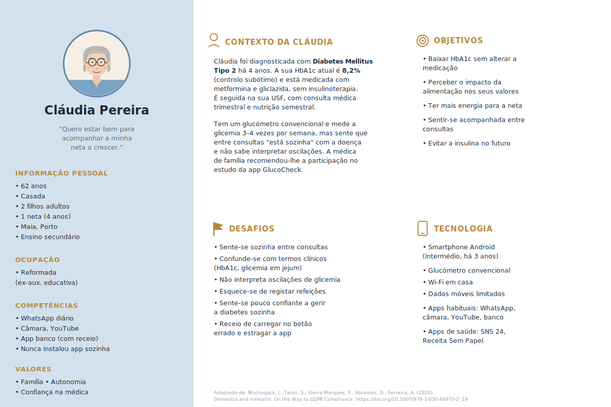
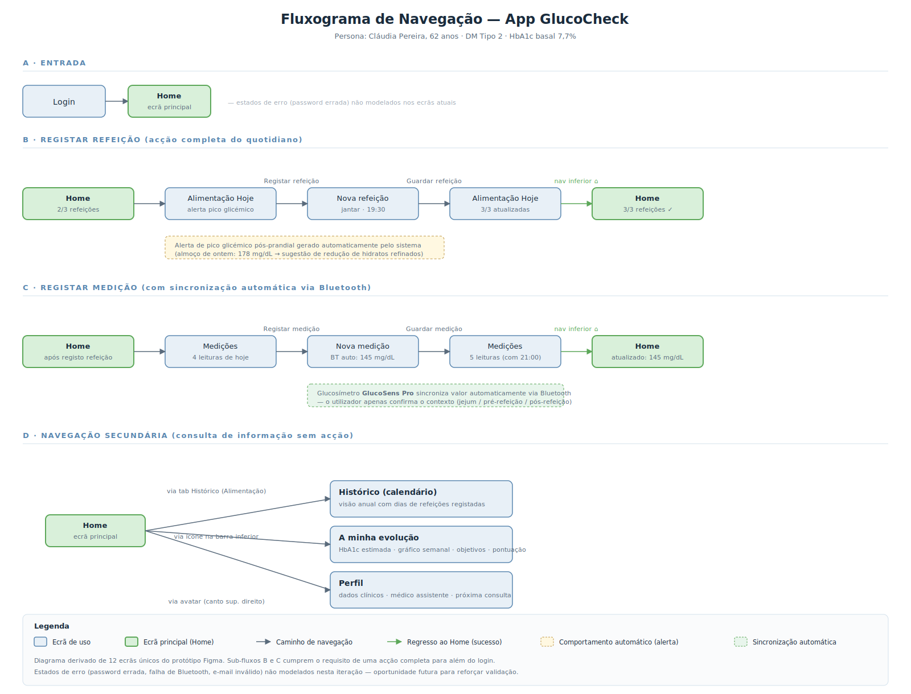

Esta página reúne os materiais desenvolvidos no âmbito do ensaio GlucoCheck:
o *Case Report Form* (CRF), o formulário electrónico em REDCap para a recolha
de dados, e os materiais de apoio à *Investigator's Meeting* — persona,
fluxograma de navegação e protótipo da aplicação móvel — produzidos no
contexto da TP8.

## CRF — *Case Report Form*

O CRF é o instrumento utilizado para registar os dados clínicos de cada participante ao longo do ensaio. Está organizado em três módulos correspondentes às avaliações do cronograma:

1. **Inclusão e baseline (T0)** — dados sociodemográficos, critérios de
   elegibilidade, HbA1c, glicemia em jejum, peso, DES-SF, DKQ-24.
2. **Avaliação intermédia (T1, semana 12)** — HbA1c, glicemia em jejum,
   peso, adesão ao registo alimentar, DES-SF.
3. **Avaliação final (T2, semana 24)** — HbA1c, glicemia em jejum, peso,
   DES-SF, DKQ-24, satisfação (DTSQ).

*A integrar — versão final do CRF em PDF ou imagens das secções.*

## Formulário REDCap

O formulário REDCap corresponde à versão electrónica do CRF, implementada
na plataforma institucional para garantir recolha segura, validação de
tipos de dados e *backup* automático dos registos. O instrumento foi
desenhado a partir do CRF e replica a estrutura modular dos três tempos
de avaliação.

*A integrar — projeto REDCap e dicionário de dados.*

## Material de apoio à *Investigator's Meeting* (TP8)

Os materiais seguintes foram desenvolvidos no âmbito da TP8 — *Suporte
para Apresentações, Comunicações UX e Prototipagem* — em apoio à
simulação de uma *Investigator's Meeting* dirigida a investigadores e
equipa clínica, com duração de 10 a 15 minutos.

### Ficha de persona

A ficha de persona representa o utilizador-tipo da aplicação GlucoCheck —
adultos entre 40 e 75 anos com Diabetes Mellitus Tipo 2 e controlo
glicémico subótimo, seguidos em cuidados de saúde primários. Constitui a
referência central no desenho da experiência de utilização da aplicação e
é citada ao longo de toda a apresentação como fio condutor narrativo.

{width=85% fig-align="center"}
### Fluxograma de navegação

O fluxograma seguinte representa a estrutura de navegação da aplicação
GlucoCheck, identificando os ecrãs principais e as ligações entre eles.
Foi a referência usada no desenvolvimento dos *wireframes* e *mockups* em
Figma, garantindo coerência entre o desenho da experiência e o protótipo
final.

{width=90% fig-align="center"}

### Protótipo interativo

O protótipo da aplicação foi desenvolvido em Figma e inclui *login*
funcional e quatro acções completas para além do *login*: registar uma
nova medição, registar uma refeição, consultar o histórico de medições e
consultar o perfil do utilizador.

[Aceder ao protótipo Figma](https://www.figma.com/proto/tbi7tGVLRPmISWLhuVj4zo/GlucoCheckG6?node-id=2-2&p=f&t=J0pLJvw4bjWKfGOB-1&scaling=scale-down&content-scaling=fixed&page-id=0%3A1&starting-point-node-id=2%3A2&show-proto-sidebar=1){target="_blank"}

### Apresentação

A apresentação foi desenhada para uma *Investigator's Meeting* de 10 a
15 minutos dirigida a investigadores e equipa clínica, seguindo o arco
narrativo *Porquê? — Como? — E então?* recomendado nos materiais da
unidade curricular.

[Descarregar a apresentação (PDF)](docs/Investigator´s Meeting.pdf){target="_blank"}

### Cumprimento dos requisitos da TP8

A tabela seguinte mapeia os requisitos definidos no enunciado da TP8 para
a respetiva evidência presente nesta página.

| Requisito do enunciado | Cumprimento | Evidência |
|---|:---:|---|
| Material de suporte à *Investigator's Meeting* | ✓ | Esta secção |
| Apresentação do estudo | ✓ | *Slides* (PDF acima) |
| Demonstração do protótipo | ✓ | *Link* Figma acima |
| Dirigida a investigadores e equipa clínica | ✓ | Audiência identificada |
| Duração de 10 a 15 minutos | ✓ | *Deck* dimensionado para ≈ 14 min |
| *Link* para o protótipo (obrigatório) | ✓ | *Link* Figma acima |
| Acção completa para além do *login* (obrigatório) | ✓ | Registar medição · Registar refeição · Histórico · Perfil |