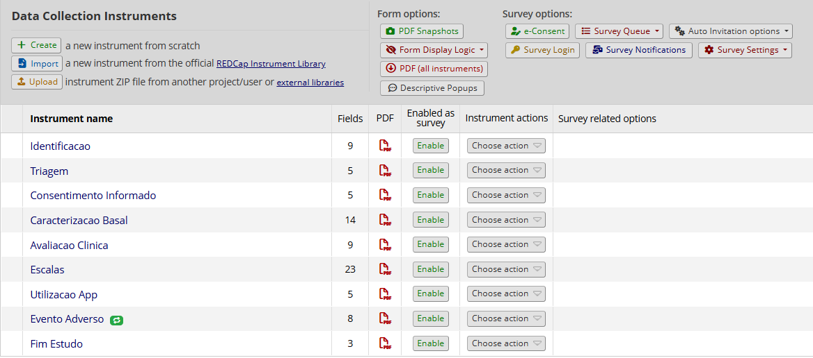
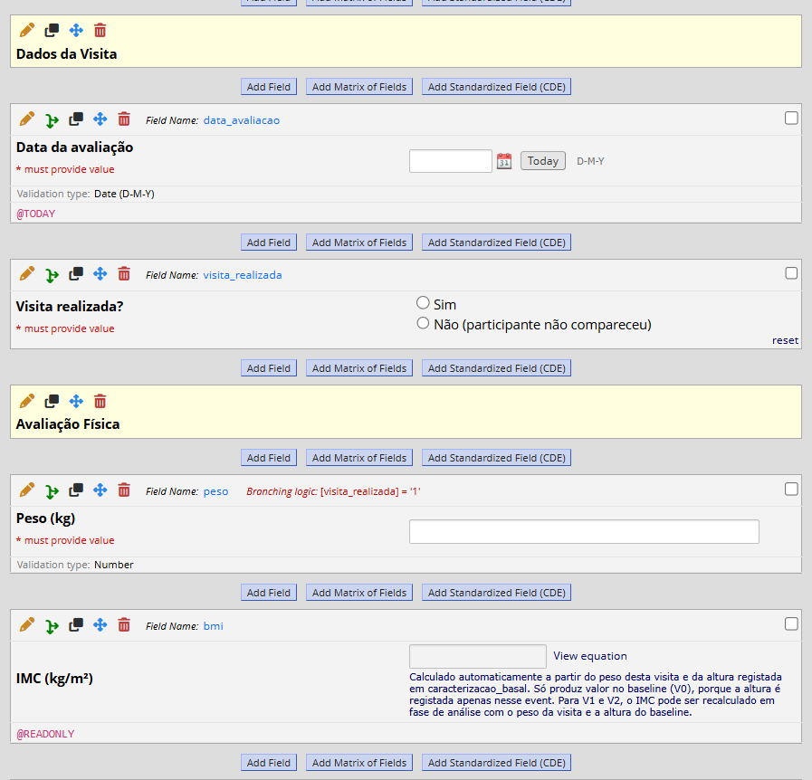
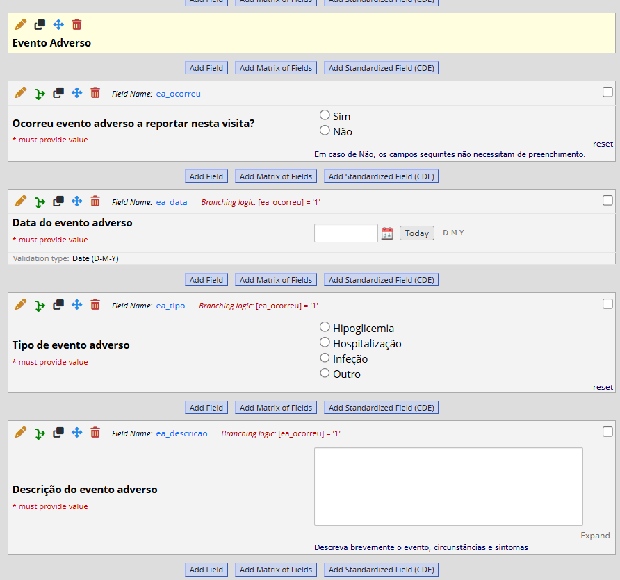

Esta página reúne os materiais desenvolvidos no âmbito do ensaio
GlucoCheck: o *Case Report Form* (CRF) e a sua implementação eletrónica
em REDCap (E7), e os materiais de apoio à *Investigator's Meeting* —
persona, fluxograma de navegação e protótipo da aplicação móvel —
produzidos no contexto da TP8.

## CRF e formulário REDCap

O eCRF do estudo GlucoCheck foi desenvolvido na plataforma **REDCap**
institucional, com uma estrutura de recolha de dados longitudinal,
organizada em **dois braços** (intervenção e controlo) e **três momentos
de avaliação** (Baseline V0, 3 meses V1, 6 meses V2), em conformidade
com o protocolo.

### Estrutura modular dos tempos de avaliação

O instrumento está organizado em três módulos correspondentes às
avaliações do cronograma:

1. **Inclusão e Baseline (V0)** — dados sociodemográficos, critérios de
   elegibilidade, HbA1c, glicemia em jejum, peso, DES-SF, DKQ-10.
2. **Avaliação intermédia (V1, 3 meses)** — HbA1c, glicemia em jejum,
   peso, adesão ao registo alimentar, DES-SF.
3. **Avaliação final (V2, 6 meses)** — HbA1c, glicemia em jejum, peso,
   DES-SF, DKQ-10, satisfação.

### Arquitetura do projeto REDCap

- **Arms.** Dois braços: *Arm 1* — grupo de intervenção (utilizadores da
  aplicação GlucoCheck); *Arm 2* — grupo de controlo (cuidados habituais).
- **Events.** Três *events* por braço: *Baseline (V0)*, *Visita aos 3
  meses (V1)* e *Visita aos 6 meses (V2)*.
- **Instrumentos.** Dez instrumentos de recolha de dados: *Screening de
  Elegibilidade*, *Consentimento Informado*, *Randomização*,
  *Caracterização Basal*, *História Clínica*, *Avaliação Clínica*,
  *Escalas Psicométricas* (DES-SF e DKQ-10), *Satisfação e Utilização*,
  *Ajuste de Medicação*, *Evento Adverso* (configurado como *repeating
  instrument*).

{width=90% fig-align="center"}

### Instrumento exemplo

A figura abaixo mostra um dos instrumentos do eCRF, ilustrando a
estrutura de campos, *labels* e *choices* utilizados.

{width=90% fig-align="center"}

### Lógica condicional e campos calculados

Foi implementada *branching logic* em vários pontos do eCRF para garantir
a relevância e a integridade dos dados recolhidos:

- A pergunta sobre capacidade de utilização de *smartphone* só aparece
  quando a resposta à posse de *smartphone* é afirmativa.
- O campo `[elegivel]` é calculado automaticamente a partir dos seis
  critérios definidos no protocolo (DM2 confirmada, HbA1c entre 7,0 e
  9,5%, seguimento em CSP, ausência de insulinoterapia, idade entre 40 e
  75 anos).
- Os campos do Consentimento Informado só aparecem se `[elegivel] = 1`,
  bloqueando o acesso aos instrumentos seguintes em participantes
  inelegíveis.
- Os campos clínicos das visitas de *follow-up* só aparecem quando a
  visita foi marcada como realizada.
- O instrumento de Utilização da App é restringido ao Arm 1 por
  designação de instrumentos a *events*.
- Os campos detalhados do instrumento de Evento Adverso só aparecem
  quando o campo *gate* `[ea_ocorreu]` indica que ocorreu um evento.

Foram igualmente implementados **campos calculados** para a
elegibilidade (binário 0/1), idade (em anos completos a partir das datas
de nascimento e admissão), *score* médio da DES-SF, pontuação do DKQ-10
e IMC no Baseline.

{width=90% fig-align="center"}

### Regras de Data Quality

O projeto inclui as **nove regras pré-definidas** do REDCap (A–I) — que
cobrem valores em falta, erros de validação, *outliers*, incoerências de
*branching logic*, campos ocultos com dados guardados e valores inválidos
em campos de escolha múltipla — e **duas regras *custom*** desenvolvidas
pelo grupo:

- **Consentimento em inelegível** — sinaliza participantes inelegíveis
  com consentimento assinado, servindo como segunda linha de defesa face
  à *branching logic*.
- **Data V1 anterior ao Baseline** — regra *cross-event cross-arm* que
  deteta erros cronológicos na sequência de visitas, em qualquer um dos
  *arms*.

### Decisões de configuração

Vários módulos opcionais do REDCap foram **avaliados e deliberadamente
não ativados**:

- **Scheduling module** — não ativado; a janela de V1 é verificada por
  regra de *Data Quality custom*.
- **Randomization module** — não ativado; em estudos piloto de 30
  participantes a aleatorização é gerida fora do REDCap (lista externa).
- **Surveys por email** — não ativado; os instrumentos auto-reportados
  (DES-SF, DKQ-10, satisfação) são preenchidos em formato
  *interviewer-administered*, alinhado com a literacia digital
  potencialmente baixa da população-alvo e com o princípio de
  minimização de dados pessoais.

### Reflexão crítica

O desenvolvimento do eCRF colocou em evidência decisões de desenho com
*trade-offs* relevantes que importa documentar:

- **Cálculo do IMC nas visitas de *follow-up*.** O campo `[bmi]`
  permanece vazio em V1 e V2 porque a variável `altura` foi registada
  apenas em V0 e o REDCap procura cada variável no *event* corrente. A
  alternativa — duplicar `altura` em todos os *events* — foi rejeitada
  para evitar redundância e risco de inconsistência. A limitação está
  documentada no próprio campo, com indicação de que o IMC pode ser
  recalculado em fase de análise estatística.
- **Validações de plausibilidade *vs.* critérios de elegibilidade.** Os
  limites de validação no dicionário (HbA1c 3–20%) são mais abrangentes
  do que o critério de inclusão (7,0–9,5%), permitindo registar valores
  reais para auditoria. A verificação do critério é delegada ao campo
  calculado `[elegivel]`, que bloqueia por *branching logic* o acesso
  aos instrumentos subsequentes.
- **Aprendizagens de processo.** A primeira tentativa de *upload* do
  dicionário falhou por o ficheiro ter sido guardado com separador `;`
  em vez de `,` (definição regional portuguesa do Excel), gerando
  dezenas de erros aparentes. Resolveu-se com re-exportação em formato
  *CSV UTF-8 delimitado por vírgulas* e validação em editor de texto
  antes do novo *upload*. Uma segunda iteração foi necessária por
  omissão do passo *Commit Changes* na pré-visualização do *import*.

### Documentos para *download*

| Documento | Formato | *Download* |
|---|:---:|---|
| Dicionário de dados completo | CSV | [E7_Grupo6_DataDictionaryAvSumativa.csv](images/E7_Grupo6_DataDictionaryAvSumativa.csv) |
| eCRF (instrumentos em branco) | PDF | [E7_Grupo6_eCRFAvSumativa.pdf](images/E7_Grupo6_eCRFAvSumativa.pdf){target="_blank"} |
| Relatório completo da E7 | PDF | [E7_Grupo6_Relatorio.pdf](images/E7_Grupo6_Relatorio.pdf){target="_blank"} |

## Material de apoio à *Investigator's Meeting* (TP8)

Os materiais seguintes foram desenvolvidos no âmbito da TP8 — *Suporte
para Apresentações, Comunicações UX e Prototipagem* — em apoio à
simulação de uma *Investigator's Meeting* dirigida a investigadores e
equipa clínica, com duração de 10 a 15 minutos.

### Ficha de persona

A ficha de persona representa o utilizador-tipo da aplicação GlucoCheck —
adultos entre 40 e 75 anos com Diabetes Mellitus Tipo 2 e controlo
glicémico subótimo, seguidos em cuidados de saúde primários. Constitui a
referência central no desenho da experiência de utilização da aplicação e
é citada ao longo de toda a apresentação como fio condutor narrativo.

{width=85% fig-align="center"}

### Fluxograma de navegação

O fluxograma seguinte representa a estrutura de navegação da aplicação
GlucoCheck, identificando os ecrãs principais e as ligações entre eles.
Foi a referência usada no desenvolvimento dos *wireframes* e *mockups* em
Figma, garantindo coerência entre o desenho da experiência e o protótipo
final.

{width=90% fig-align="center"}

### Protótipo interativo

O protótipo da aplicação foi desenvolvido em Figma e inclui *login*
funcional e quatro acções completas para além do *login*: registar uma
nova medição, registar uma refeição, consultar o histórico de medições e
consultar o perfil do utilizador.

[Aceder ao protótipo Figma](https://www.figma.com/proto/tbi7tGVLRPmISWLhuVj4zo/GlucoCheckG6?node-id=2-2&p=f&t=J0pLJvw4bjWKfGOB-1&scaling=scale-down&content-scaling=fixed&page-id=0%3A1&starting-point-node-id=2%3A2&show-proto-sidebar=1){target="_blank"}

### Apresentação

A apresentação foi desenhada para uma *Investigator's Meeting* de 10 a
15 minutos dirigida a investigadores e equipa clínica, seguindo o arco
narrativo *Porquê? — Como? — E então?* recomendado nos materiais da
unidade curricular.

[Descarregar a apresentação (PDF)](images/InvestigatorsMeeting.pdf){target="_blank"}

### Cumprimento dos requisitos da TP8

A tabela seguinte mapeia os requisitos definidos no enunciado da TP8 para
a respetiva evidência presente nesta página.

| Requisito do enunciado | Cumprimento | Evidência |
|---|:---:|---|
| Material de suporte à *Investigator's Meeting* | ✓ | Esta secção |
| Apresentação do estudo | ✓ | *Slides* (PDF acima) |
| Demonstração do protótipo | ✓ | *Link* Figma acima |
| Dirigida a investigadores e equipa clínica | ✓ | Audiência identificada |
| Duração de 10 a 15 minutos | ✓ | *Deck* dimensionado para ≈ 14 min |
| *Link* para o protótipo (obrigatório) | ✓ | *Link* Figma acima |
| Acção completa para além do *login* (obrigatório) | ✓ | Registar medição · Registar refeição · Histórico · Perfil |